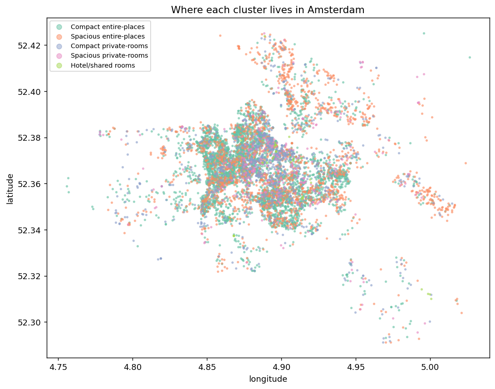
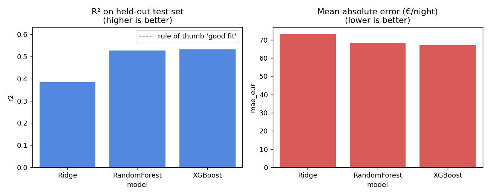
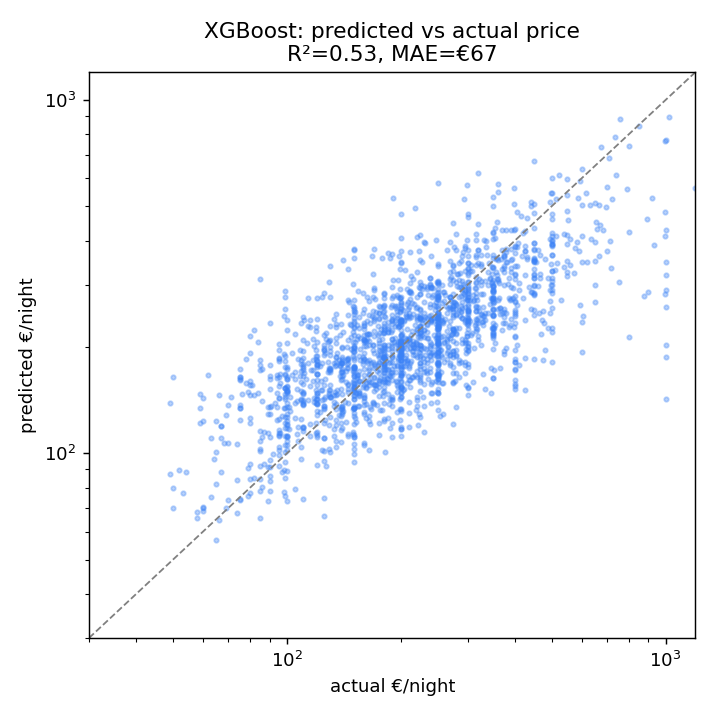
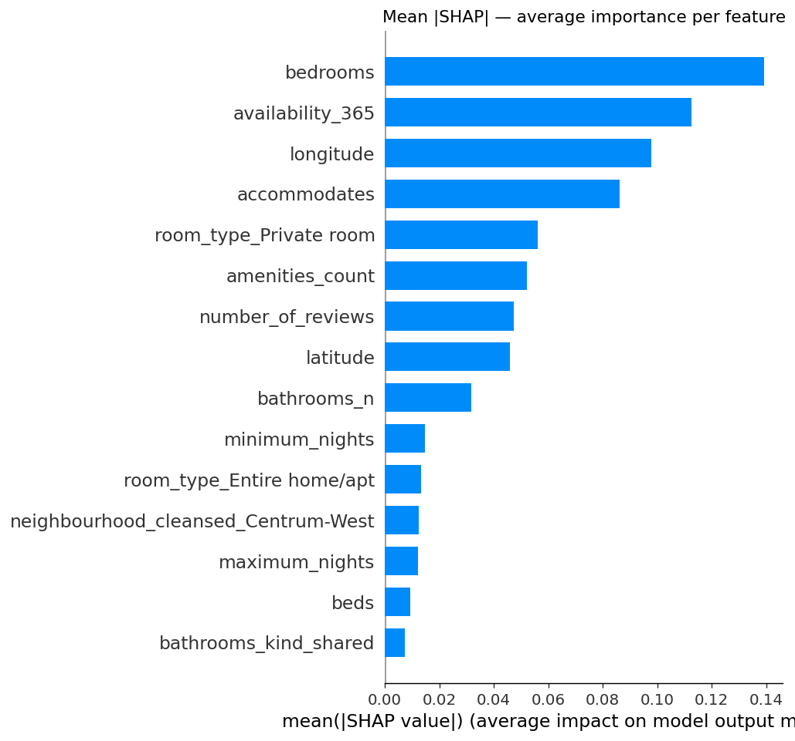
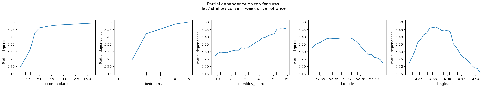
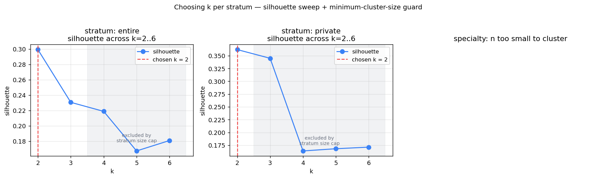
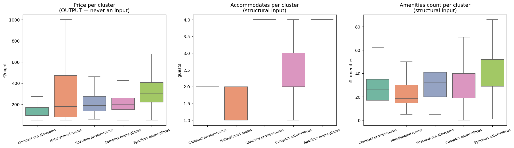

# Amsterdam Airbnb — Market Segments

**A short, honest project about the limits of static features for price prediction, and what you can do instead.**

Live demo *(enable GitHub Pages on the `main` branch first)*: [`https://diklinuks.github.io/Airbnb-Machine-learning/web/`](https://diklinuks.github.io/Airbnb-Machine-learning/web/)



---

## TL;DR

I set out to build an interpretable **fair-price estimator** for Amsterdam Airbnb listings.
Using only the static listing features available in the public Inside Airbnb dataset
(size, room type, amenities, neighbourhood, location), the best regression model reached
**R² ≈ 0.53** with **MAE ≈ €67** on a €200-median listing — about a third off on a typical
night.

I then used Explainable AI tools (**SHAP, partial dependence**) to look at *why*. The
explanations showed that the available features carry weak and shallow signal. Real-world
short-term-rental prices depend on dynamic factors the dataset doesn't contain:
seasonality, tourism flow, events, competitor prices, city regulations.

Rather than ship a misleading "fair price" tool, the project pivots to a more honest
output:

- A **descriptive segmentation** of the market into 5 interpretable clusters
- Built with a methodology that, unlike the first version, doesn't leak price into the clustering features
- Served as a small **interactive map** of Amsterdam — click a neighbourhood, see its segment mix

The full reasoning for this decision is in [`Explainable AI.pdf`](./Explainable%20AI.pdf).

---

## What's in this repo

```
.
├── src/
│   ├── data_prep.py          # Inside Airbnb → cleaned parquet
│   ├── regression_xai.py     # Ridge / RF / XGB + SHAP + PDP
│   └── clustering.py         # stratified k-means + k-selection
├── data/
│   ├── raw/march 2025/       # source CSVs (not committed; download from Inside Airbnb)
│   └── processed/            # listings_clean.parquet, cluster artifacts
├── reports/figures/          # all PNGs referenced in this README
├── web/                      # static demo — index.html + app.js + data.json
├── notebooks/                # airbnb_v0.ipynb — the original exploration notebook
├── archive/                  # earlier iterations kept for honesty / history
├── Individual Proposal.pdf   # original project proposal
├── Explainable AI.pdf        # mid-project reflection — the "no-go for production" memo
├── requirements.txt
└── README.md
```

---

## How to run it

```bash
# 1. set up the env
pip install -r requirements.txt

# 2. download Inside Airbnb's Amsterdam March 2025 snapshot
#    listings-main.csv, calendar.csv, neighbourhoods.geojson, neighbourhoods.csv
#    → put them under: data/raw/march 2025/

# 3. run the pipeline (each step is independent and writes its outputs to disk)
python src/data_prep.py        # ~30s — cleans listings and calendar
python src/regression_xai.py   # ~2min — fits 3 models, computes SHAP, makes PDPs
python src/clustering.py       # ~20s — stratified k-means, k-sweep, exports web/data.json

# 4. serve the static demo locally
python -m http.server 8000 --directory web
# open http://localhost:8000
```

Each script is self-contained, prints what it's doing, and writes its outputs to a
predictable folder. No notebooks required.

---

## Part 1 — Why price prediction doesn't work here

### The regression numbers

Three models on the cleaned dataset (7,846 listings, 80/20 split, target = log price):

| Model            | R²    | MAE on log | MAE in €  |
|------------------|------:|-----------:|----------:|
| Ridge            | 0.384 |     0.307  |    73.3   |
| Random Forest    | 0.527 |     0.281  |    68.3   |
| XGBoost          | **0.532** | **0.278** | **67.0** |



**Honest read:** R² ≈ 0.53 means the model captures roughly half of the variance in
log-price. That's not zero — but on a €200-median listing the typical absolute error is
**~€67 (about 33%)**. That's too wide for "fair price" advice.



### What SHAP reveals

SHAP on the Random Forest highlights the features that move log-price most:



`bedrooms` (top) has mean |SHAP| ≈ 0.14 in log space — about ±15% on price.
`availability_365`, `longitude`, `accommodates` follow. After that, importance drops off
fast.

Partial-dependence on the top five numeric features:



These curves are real but **shallow**. The biggest swing is `accommodates` rising from
~5.20 to ~5.50 in log-price space across its whole range — that's an `exp(0.30) ≈ 1.34×`
price change. Real prices in this dataset span an order of magnitude (€49 to €1,199). So
the model can capture the *ballpark* but not the right price for any specific listing.

**The XAI finding the project rests on:** the static listing features available in
Inside Airbnb are insufficient to learn nightly-price. Production pricing systems also
use seasonality, demand, events, competitor prices, and city regulations. None of these
are in the snapshot dataset. This is not a model-tuning problem; it's a data problem.

A longer version of this argument is in [`Explainable AI.pdf`](./Explainable%20AI.pdf).

---

## Part 2 — A clustering that doesn't cheat

### What was wrong with v1

The first clustering pass (preserved in [`notebooks/airbnb_v0.ipynb`](notebooks/airbnb_v0.ipynb))
had four methodological problems:

1. **Price leaked into the clustering features.** The input set included `price`,
   `log_price`, `rel_price`, `price_per_person`, `price_per_bed`, `price_normalized`,
   and `median_price_neigh` — seven price-derived columns. KMeans then "discovered"
   that clusters separate by price, and was labelled "low/mid/upper_mid/high." This
   is circular: clusters discover what they were given.
2. **The "fairness label" was doubly circular.** "Under/fair/over priced" was defined
   as deviation from the cluster's median price, but the cluster was already defined
   partly by price. The label is a tautology dressed up as an insight.
3. **One-hot columns drowned the signal.** Throwing ~90 numerics + 50+ binary dummies
   straight into StandardScaler made the dummies collectively dominate the distance
   metric in PCA space.
4. **`k = 4` was unjustified.** Five algorithms were compared, all at `k = 4`, with no
   sweep across other values.

### v2 — stratified k-means with proper k-selection

**Feature set: structural only.** Seven numeric features used for clustering:
`accommodates`, `bedrooms`, `beds`, `bathrooms_n`, `amenities_count`, `latitude`,
`longitude`. Price is *never* a clustering input — it's only computed per cluster
afterwards for description.

**Stratify by room type first.** ~80% of listings are "Entire home/apt", ~19% are
"Private room", ~1% are hotel/shared rooms. These are different *products*, not points
on a continuum. Flat k-means treated `room_type` as just another feature; stratifying
recognises it as a categorical product axis.

**Pick k by silhouette + a minimum-cluster-size guard.** Within each stratum I sweep
`k = 2..6` and pick the highest silhouette whose smallest cluster contains ≥ 50
listings. Without that guard, silhouette can reward k-values where one "cluster" is
a handful of outliers.



**Resulting 5 segments (sorted by median price):**

| # | Segment                  | n     | Median € | Typical guests | Dominant room type |
|---|--------------------------|------:|---------:|---------------:|--------------------|
| 2 | Compact private-rooms    | 1,200 | 126      | 2              | Private room       |
| 4 | Hotel/shared rooms       |    52 | 180      | 1–2            | Hotel room         |
| 3 | Spacious private-rooms   |   276 | 190      | 4              | Private room       |
| 0 | Compact entire-places    | 4,281 | 200      | 2              | Entire home/apt    |
| 1 | Spacious entire-places   | 2,037 | 300      | 4              | Entire home/apt    |



Note that the **price box-plot is left-to-right monotone by construction of the column
order** — but price was *not* an input to the clustering. The fact that structural
segments still come out neatly ordered by price is an empirical finding, not an
assumption built into the method.

---

## Part 3 — The web demo

[`web/`](./web/) is a static site with no build step:

- [`index.html`](./web/index.html) — page skeleton, ~3 KB
- [`app.js`](./web/app.js) — vanilla JS, no framework, ~9 KB
- [`styles.css`](./web/styles.css) — hand-rolled, ~3 KB
- [`data.json`](./web/data.json) — all clusters + neighbourhood breakdowns + centroids in one file, ~15 KB
- [`neighbourhoods.geojson`](./web/neighbourhoods.geojson) — Amsterdam polygons from Inside Airbnb

It does three things:

1. **Map** — Amsterdam's 22 neighbourhoods coloured by dominant segment. Click a
   neighbourhood for its full segment composition and median price.
2. **Segment cards** — click a segment in the legend to dim everywhere it isn't dominant.
3. **"Find your segment"** — describe a listing, get matched to the nearest centroid in
   scaled feature space (computed in JS — no Python in the browser).

Replaces the earlier Pyodide-based [`archive/index_pyodide_v0.html`](./archive/index_pyodide_v0.html)
which loaded ~30 MB of Python on first paint.

---

## Honest limitations

- **R² ≈ 0.53 is the ceiling for this feature set.** Adding dynamic data (calendar
  booking history beyond availability, seasonality dummies, events, competitor prices)
  would likely close most of the gap, but those signals are out of scope for the
  public Inside Airbnb snapshot.
- **The segmentation is descriptive, not prescriptive.** It describes how Amsterdam's
  Airbnb inventory is shaped. It does **not** say a given listing is over- or
  under-priced — the v1 fairness label is intentionally absent in v2.
- **One snapshot, March 2025.** Inside Airbnb publishes monthly snapshots. Patterns will
  drift with regulation, tourism, and platform changes.

---

## What I'd do next

1. Add temporal features from the full Inside Airbnb history (multiple snapshots,
   seasonality decomposition on the calendar).
2. Compare to a published baseline — there are several academic papers on Inside Airbnb
   Amsterdam pricing that land in the R² 0.5–0.7 range; replicating one would be a fair
   reference point.
3. Move the demo from a single static page to a small FastAPI service so the predict
   form can use the actual trained model rather than nearest-centroid in JS.
4. Hard-link to a richer review-text feature set (e.g. sentiment over recent reviews) —
   one of the features production systems use that this project doesn't.

---

## Acknowledgements

- Data: [Inside Airbnb](http://insideairbnb.com/get-the-data/) — Amsterdam, March 2025 snapshot
- Map tiles: CARTO + OpenStreetMap contributors
- Done as the individual project for Fontys AI Foundations 2025–26
